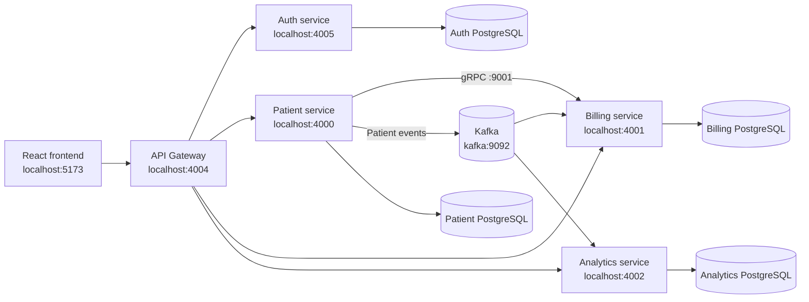

# Patient Management Platform

A full-stack patient management system built with Spring Boot microservices, React, PostgreSQL, Apache Kafka, gRPC, Docker, and JWT authentication.

The platform lets authenticated users manage patients and view registration analytics. Patient events are published to Kafka and consumed by the billing and analytics services.

## Features

- Patient CRUD operations
- JWT-based authentication
- API Gateway with routing, CORS, and JWT validation
- Billing account creation through gRPC
- Patient event processing with Kafka
- Daily patient registration analytics
- PostgreSQL persistence per service
- Dockerized services on a shared Docker network
- React and TypeScript dashboard
- OpenAPI documentation for supported services

## Architecture



## Technology Stack

### Backend

- Java 21
- Spring Boot
- Spring Data JPA / Hibernate
- Spring Cloud Gateway
- Spring Security and JWT
- Apache Kafka
- gRPC and Protocol Buffers
- PostgreSQL
- Maven

### Frontend

- React 19
- TypeScript
- Vite
- React Router
- TanStack Query
- Axios
- Recharts
- Tailwind CSS

### Infrastructure

- Docker
- Docker Desktop
- Shared Docker network: `internal`

## Project Structure

```text
patient-service/    Patient REST API, persistence, Kafka producer, gRPC client
billing-service/    Billing REST API, gRPC server, Kafka consumer
analytics-service/  Registration analytics REST API and Kafka consumer
auth-service/       Login, JWT generation, and token validation
api-gateway/        Routing, CORS, and JWT validation
frontend/           React dashboard
grpc-requests/      HTTP and gRPC request examples
```

## Prerequisites

Install the following before running the project:

- Java 21 or newer
- Docker Desktop
- Node.js 20 or newer
- npm

Docker Desktop must be running.

## Service Ports

| Component | Port | Purpose |
|---|---:|---|
| Frontend | `5173` | React development server |
| API Gateway | `4004` | Main HTTP entry point |
| Patient service | `4000` | Patient REST API |
| Billing service | `4001` | Billing REST API |
| Analytics service | `4002` | Analytics REST API |
| Auth service | `4005` | Authentication API |
| Billing gRPC | `9001` | Patient-to-billing communication |
| Kafka | `9092` | Event streaming |

## Docker Setup

### Quick Start With Docker Compose

Docker Compose starts the four PostgreSQL databases, Kafka, all backend services, and the frontend:

```powershell
docker compose up --build
```

Open the application at [http://localhost:5173](http://localhost:5173). The API Gateway is available at `http://localhost:4004`.

To stop the stack:

```powershell
docker compose down
```

To stop the stack and remove its development database volumes for a completely fresh start:

```powershell
docker compose down -v
```

The Compose file uses the shared `internal` Docker network and waits for PostgreSQL and Kafka before starting dependent services. Database credentials and JWT settings in this setup are development-only values.

Compose creates the internal network, four PostgreSQL databases, Kafka, the patient event topic, all backend services, and the frontend. The service hostnames and environment variables are defined in `docker-compose.yml`, so they do not need to be repeated here.

For manual container operation, use `docker-compose.yml` as the source of truth for image names, ports, networks, health checks, and environment variables.

## Start the Frontend

```powershell
cd frontend
npm install
npm run dev
```

Open [http://localhost:5173](http://localhost:5173).

The frontend uses the API Gateway at `http://localhost:4004` by default. To override it:

```powershell
$env:VITE_API_BASE_URL='http://localhost:4004'
npm run dev
```

## Authentication

The development seed data includes these users:

| Email | Password |
|---|---|
| `testuser@test.com` | `password123` |
| `test@example.com` | Seeded development account; use the password configured for your local environment |

Login through the gateway:

```http
POST http://localhost:4004/auth/login
Content-Type: application/json

{
  "email": "testuser@test.com",
  "password": "password123"
}
```

Use the returned token as:

```text
Authorization: Bearer <token>
```

These credentials are for local development only and must not be used in production.

## API Endpoints

| Method | Gateway endpoint | Description |
|---|---|---|
| `POST` | `/auth/login` | Generate a JWT |
| `GET` | `/auth/validates` | Validate a JWT |
| `GET` | `/api/patients` | List or search patients |
| `POST` | `/api/patients` | Create a patient |
| `PUT` | `/api/patients/{id}` | Update a patient |
| `DELETE` | `/api/patients/{id}` | Delete a patient |
| `PATCH` | `/api/billing/accounts/{id}/status` | Update billing status |
| `GET` | `/api/analytics/patients/summary` | Get daily registration counts |

Example patient payload:

```json
{
  "name": "Alex Morgan",
  "email": "alex.morgan@example.com",
  "address": "123 Main Street",
  "birthDate": "1990-01-01",
  "registeredDate": "2026-10-10"
}
```

Patient creation persists the patient, creates a billing account through gRPC, and publishes a Kafka event consumed by billing and analytics.

## API Documentation

When running locally, patient OpenAPI documentation is available at:

- [Patient service OpenAPI JSON](http://localhost:4000/v3/api-docs)
- [Gateway patient OpenAPI route](http://localhost:4004/api-docs/patients)
- [Auth service OpenAPI JSON](http://localhost:4005/v3/api-docs)

## Local Development Without Docker

Each backend service includes a Maven wrapper:

```powershell
cd patient-service
./mvnw spring-boot:run
```

For local Java execution, override Docker hostnames with local infrastructure values, for example:

```powershell
$env:SPRING_DATASOURCE_URL='jdbc:postgresql://localhost:5432/db'
$env:SPRING_DATASOURCE_USERNAME='admin_user'
$env:SPRING_DATASOURCE_PASSWORD='password'
$env:JAVA_TOOL_OPTIONS='-Duser.timezone=UTC'
./mvnw spring-boot:run
```

The Docker-network setup is recommended because the gateway and service-to-service configuration uses Docker hostnames such as `patient-service`, `billing-service`, and `kafka`.

## Testing

Frontend build:

```powershell
cd frontend
npm run build
```

### Integration Test Coverage

The project includes Spring Boot integration tests for the main service workflows:

| Service | Coverage |
|---|---|
| Auth | Valid login returns a JWT; invalid credentials return `401` |
| Patient | Patient creation persists a record, generates a UUID, and invokes billing/Kafka boundaries |
| Billing | Billing status updates persist; unknown statuses return `400` |
| Analytics | Registration summaries return counts from the last 30 days |

The tests use real Spring controllers, validation, repositories, and H2 databases. External process boundaries such as gRPC and Kafka are isolated where appropriate so the tests remain fast and deterministic.

Run each integration suite from its service directory:

```powershell
cd auth-service
./mvnw -Dtest=AuthIntegrationTest test

cd ../patient-service
./mvnw -Dtest=PatientIntegrationTest test

cd ../billing-service
./mvnw -Dtest=BillingIntegrationTest test

cd ../analytics-service
./mvnw -Dtest=AnalyticsIntegrationTest test
```

Run all tests for an individual service:

```powershell
cd patient-service
./mvnw test
```

The isolated integration tests do not require Docker, PostgreSQL, or Kafka. The legacy `contextLoads` test in `patient-service` starts the full application context and requires a reachable PostgreSQL instance.

Docker image builds use `-DskipTests` because image builders do not have the application databases available. Run Maven tests separately with the commands above.


## Project Status

This project is a local development and portfolio project. It demonstrates microservice communication, event-driven processing, authentication, persistence, and container orchestration. 
